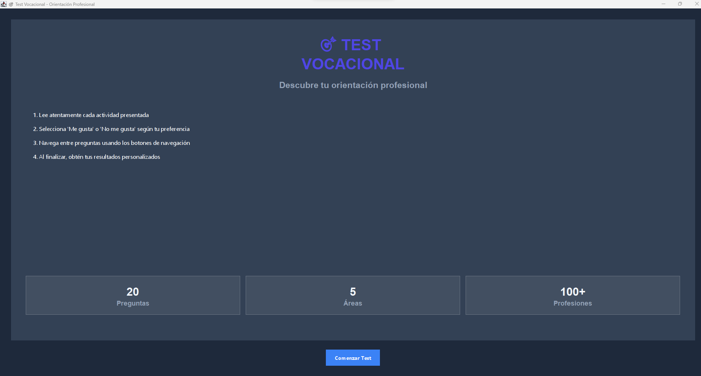
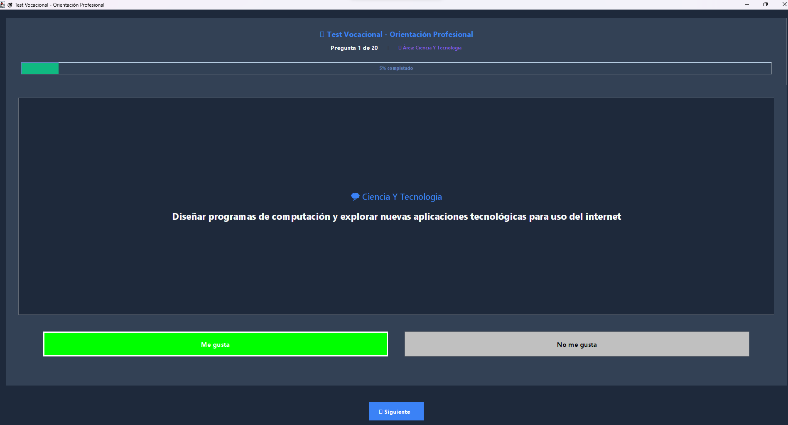
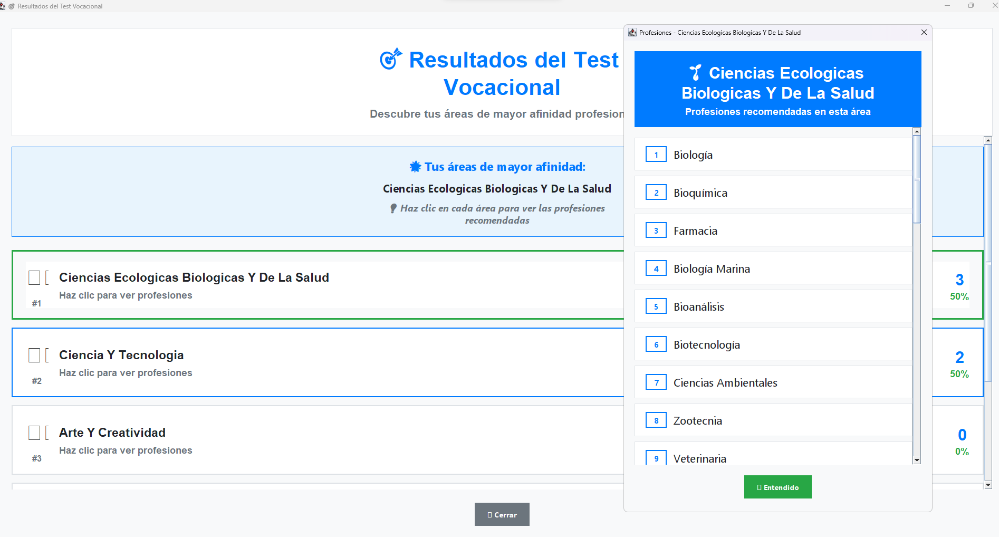

# Test Vocational App

## Descripción

Esta es una aplicación Java que permite a los usuarios realizar un test vocacional para identificar áreas de interés profesional. Basado en una serie de preguntas, el test evalúa las preferencias y habilidades del usuario para proporcionar resultados personalizados.

## Características Principales

- Interfaz gráfica intuitiva y fácil de usar.
- Base de datos de preguntas cuidadosamente seleccionadas.
- Resultados detallados y personalizados basados en las respuestas del usuario.
- Opción para reiniciar el test y explorar diferentes opciones.

## Capturas de Pantalla

*Interfaz principal de la aplicación.*

*Ejemplo de preguntas obtenidas para completar el test.*

*Ejemplo de resultados obtenidos después de completar el test.*

## Instrucciones de Ejecución

### Requisitos Previos

- Java Development Kit (JDK) instalado en el sistema.

### Compilación y Ejecución

1. Clona el repositorio en tu máquina local:
  git clone https://github.com/c66dx/testVocacional
2. Navega hasta el directorio del proyecto:
  cd testVocacional
3. Compila el código fuente utilizando el siguiente comando:
  javac -d bin -cp src src/Controlador/TestVocationalGUI.java
4. Ejecuta la aplicación con el siguiente comando:
  java -cp bin Controlador.TestVocationalGUI

### Uso de la Aplicación

1. Sigue las instrucciones en la pantalla para completar el test vocacional.
2. Selecciona una respuesta para cada pregunta y haz clic en el botón "Siguiente" para avanzar.
3. Al finalizar el test, haz clic en el botón "Resultados" para ver tus resultados personalizados.

## Contribuciones

Las contribuciones son bienvenidas. Si deseas contribuir a este proyecto, por favor sigue estos pasos:

1. Crea un fork del repositorio.
2. Realiza tus cambios en una nueva rama (`git checkout -b feature/nueva-caracteristica`).
3. Realiza los commits de tus cambios (`git commit -am 'Añadir nueva característica'`).
4. Haz push de tus cambios a la rama (`git push origin feature/nueva-caracteristica`).
5. Crea un nuevo pull request.

